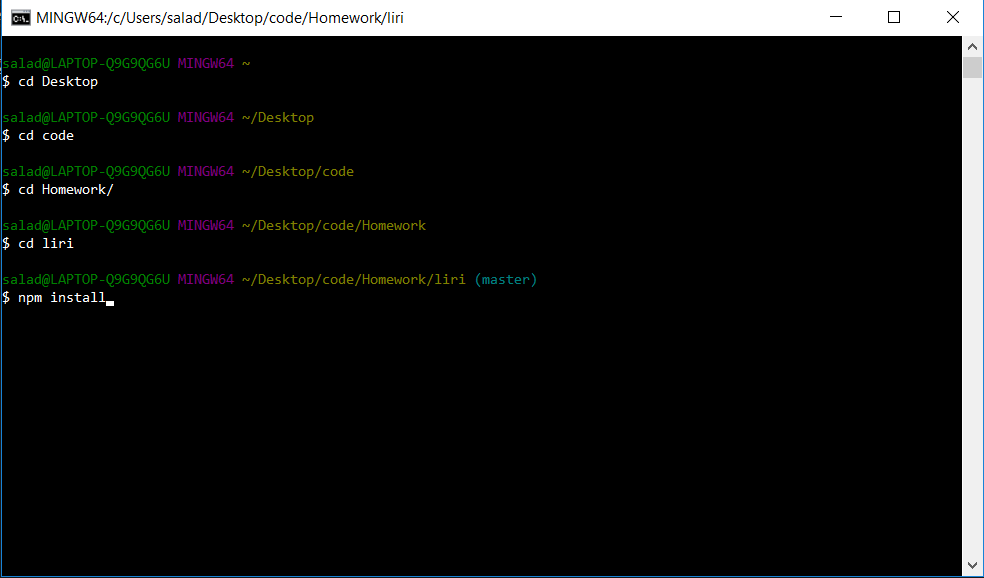
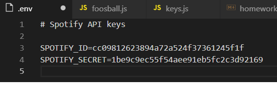
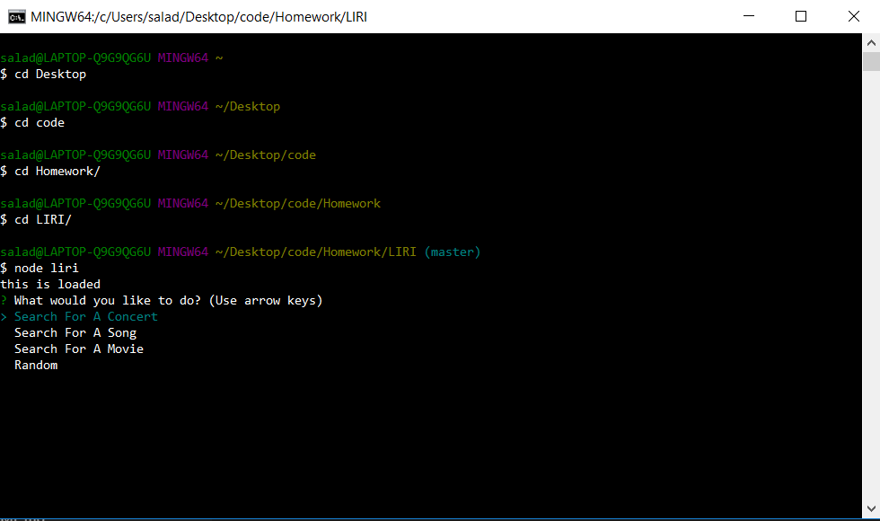
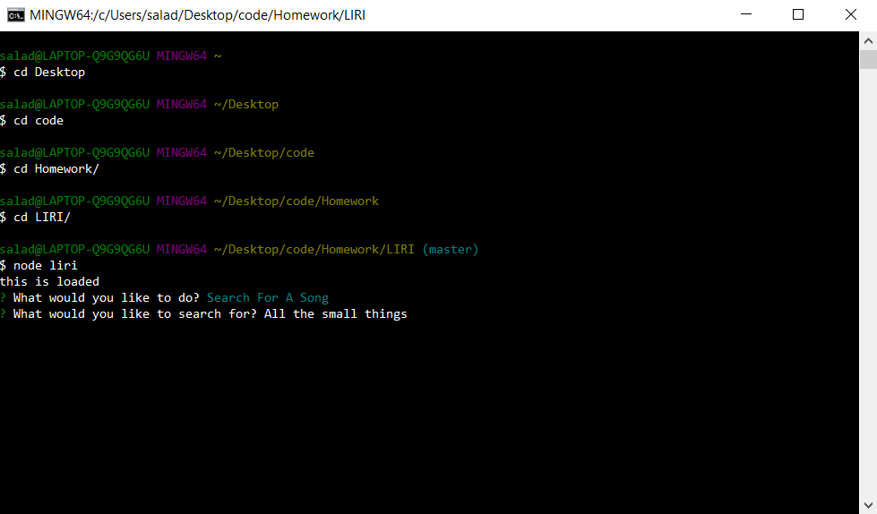
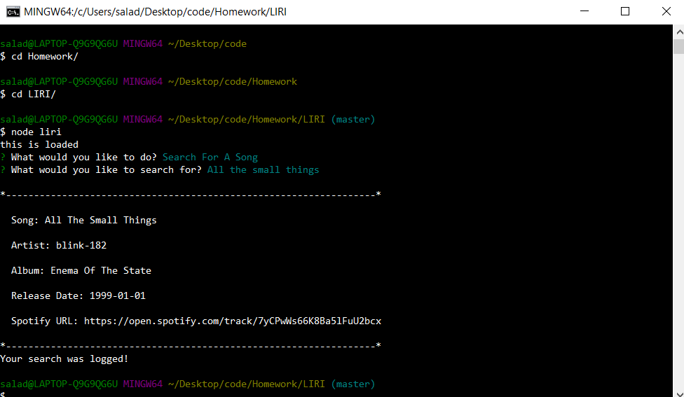

# LIRI
LIRI is a Language Interpretation and Recognition Interface that runs through the Node command-line.

It offers four different search parameters 'Search for a concert', 'Search for a song', 'Search for a movie', and 'Random'.

This project _REQUIRES_ node js to be installed.

In order to get up and running with the app you will first have to create some files and install all neccesary node modules.

Firstly, you will need to open up your Terminal on Mac or Gitbash on windows. Then navigate to the directory in which LIRI is installed. You will then need to enter the command 'npm install' like so.



Next you will need to create an env file. To so create a new file in the root directory of the LIRI folder and title it '.env'. You will then need to paste the following code _EXACTLY_ and replace the placeholder text in quotes with your own spotify id and secret which you can get at [Spotify API](https://developer.spotify.com/).

```js
# Spotify API keys

SPOTIFY_ID='Your spotify ID'
SPOTIFY_SECRET='Your spotify secret'
```
Your file should look like this.



Next you will need to create a folder called ignored inside the root directory. Inside that folder you will need to create a javascript file called 'api_keys.js'. Inside of that file you will then need to paste the following code _EXACTLY_ and replace the placeholder text in quotes with your own bandsintown and omdb keys which you can get from [OMDB API](http://www.omdbapi.com) and the [Bands In Town API](http://www.artists.bandsintown.com/bandsintown-api).

```js
const api_key = {
    omdb: 'Your omdb apikey',
    bandsintown: 'Your bandsintown apikey'
}

module.exports = api_key;
```

Congrats you are now ready to start using LIRI!

To start you will need to open up your Terminal(Mac) or Gitbash(Windows) and navigate to the root directory of LIRI. Next you will need to type in the command 'node liri'. You will then be prompted with a list of four options like this.



Select the options using the up and down arrow keys and choose an option by hitting 'enter'. Once you have selected an option you will then be prompted with another question asking what you would like to search for. Simply type in what you would like to search and hit enter.





You will receive your search result and the search will also be logged to your 'log.txt' file found in the root directory of LIRI.